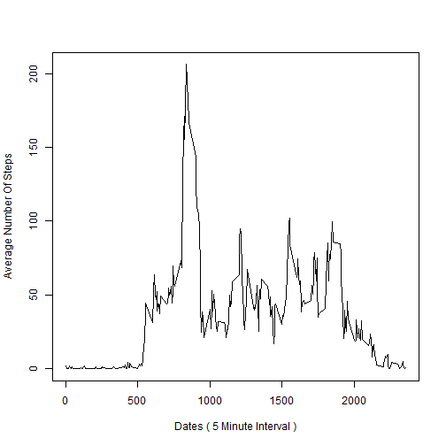
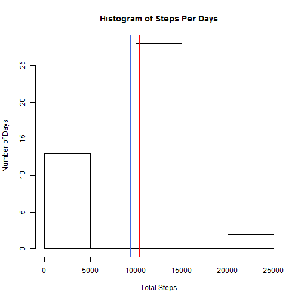
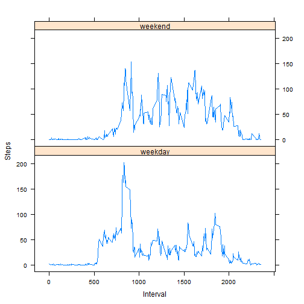

___________________________________________________________________________________________________


## About
___________________________________________________________________________________________________
This is the first project for the Reproducible Research course in Coursera's Data Science track. The purpose of the project was to answer a series of questions using data collected from [here](https://d396qusza40orc.cloudfront.net/repdata%2Fdata%2Factivity.zip).

## Synopsis
___________________________________________________________________________________________________
The purpose of this project was to practice:

* loading and preprocessing data
* imputing missing values
* interpreting data to answer research questions


## Data
___________________________________________________________________________________________________
The data for this assignment was downloaded from the course web site:

* Dataset: [Activity monitoring data [52K]

The variables included in this dataset are:

* **steps**: Number of steps taking in a 5-minute interval (missing values are coded as NA)

* **date**: The date on which the measurement was taken in YYYY-MM-DD format

* **interval**: Identifier for the 5-minute interval in which measurement was taken

The dataset is stored in a comma-separated-value (CSV) file and there are a total of 17,568 observations in this dataset.


## Loading and preprocessing the data
___________________________________________________________________________________________________

Load the data using read.csv


```r
activity<-read.csv("activity.csv",sep=",",header=TRUE,na.strings="NA")
```

## What is mean total number of steps taken per day?

Remove the missing values from the dataset. Store the total number of steps taken by day in data table. Make a histogram of total number of steps by day.


```r
cleanactivity<-activity[complete.cases(activity),]
library(data.table)
DT <- data.table(cleanactivity)
DT<-DT[, sum(steps), by = date]
hist(DT$V1, main ="Histogram of Steps Per Days", xlab="Number of Steps",ylab="Number of Days")
```

 

Report the mean and median of the total number of steps taken per day


```r
meanstepsperday<-mean(DT$V1)
medianstepsperday<-median(DT$V1)
```

The mean is 10766.19 and the median is 10765

##What is the average daily activity pattern?
___________________________________________________________________________________________________


1. Make a time series plot (i.e. type = "l") of the 5-minute interval (x-axis) and the average  number of steps taken, averaged across all days (y-axis)


```r
steps_by_interval <- aggregate(steps ~ interval, activity, mean)
with(steps_by_interval,plot(steps_by_interval$interval,steps_by_interval$steps,type="l",xlab="Dates ( 5 Minute Interval )",ylab="Average Number Of Steps"))
```

 

2. Which 5-minute interval, on average across all the days in the dataset, contains the maximum number of steps?


```r
max_interval <- steps_by_interval[which.max(steps_by_interval$steps),1]
```

The interval for maximum number of steps is 835

##Imputing missing values
___________________________________________________________________________________________________

1. Total number of missing values in the dataset (i.e. the total number of rows with NAs)


```r
nrow(activity[!complete.cases(activity),])
```

```
## [1] 2304
```

Total Number of missing Values is 2304

2. Missing values are imputed with mean steps of that particular day. If the mean of is NA then 0 is imputed

And

3. The new dataset is created with missing data filled in


```r
data<-read.csv("activity.csv",sep=",",header=TRUE,na.strings="NA")

# following code will transform the data frame,it updates the steps variable for given observation if it is null with the mean of that particular day. If the mean steps of given day is NA, then it is filled in with 0.  
mean_steps_by_day <- aggregate(steps ~ date, data, mean)
data <- transform(data, steps = ifelse(is.na(data$steps), ifelse(is.na(mean_steps_by_day$steps[match(data$date, mean_steps_by_day$date)]),0,mean_steps_by_day$steps[match(data$date, mean_steps_by_day$date)]), data$steps))
```

4. Histogram of total number of steps taken each day


```r
#datewisesum<-data[,sum(steps), by = date]
steps_by_day <- aggregate(steps ~ date, data, sum)
hist(steps_by_day$steps, main ="Histogram of Steps Per Days", xlab="Total Steps",ylab="Number of Days")
abline(v = mean(steps_by_day$steps),col = "royalblue",lwd = 2)
abline(v = median(steps_by_day$steps),col = "red",lwd = 2)
```

 

Mean and Median of filled in missing data


```r
filledinmean<-mean(steps_by_day$steps)
filledinmedian<-median(steps_by_day$steps)
totaldaylysteps<-sum(aggregate(steps~date,activity,sum)$steps)
totaldailystepsfilledin<-sum(aggregate(steps~date,data,sum)$steps)
```

* Mean of missing value filled in data is 9354.23 and median is 10395

* Difference of mean between data ( missing values not filled) and data ( filled missing values ) is = 10766.19 - 9354.23 = **1411.96**

* Difference of median between data ( missing values not filled) and data ( filled missing values ) is = 10765 - 10395 = **370**

* There is no difference between total number of steps taken after imputing missing data with mean of that particular day. This is confimed by looking at data. There are 8 days which has missing ( NA ). Data is missing for all the intervals of these 8 days. Hence, these are imputed with 0. This is the reason of having no difference. 

## Are there differences in activity patterns between weekdays and weekends?
_______________________________________________________________________________________________________________________

Following will create a new factor variable in the dataset with two levels - "weekday" and "weekend" indicating whether a given date is a weekday or weekend day.


```r
data$dattype <- ifelse(weekdays(as.Date(data$date)) =="Saturday" | weekdays(as.Date(data$date)) =="Sunday","weekend", "weekday")
```


Following will create panel plot containing a time series plot (i.e. type = "l") of the 5-minute interval (x-axis) and the average number of steps taken, averaged across all weekday days or weekend days (y-axis)


```r
dt <- aggregate(steps ~ interval + dattype, data, mean)
library(lattice)
p <- xyplot(dt$steps ~ dt$interval | factor(dt$dattype), xlab="Interval",ylab="Steps",layout=c(1,2),type="l")
print(p)
```

 
